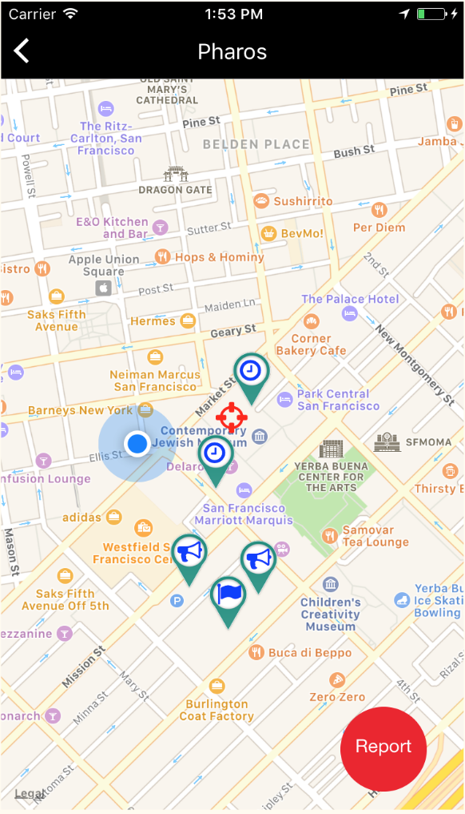
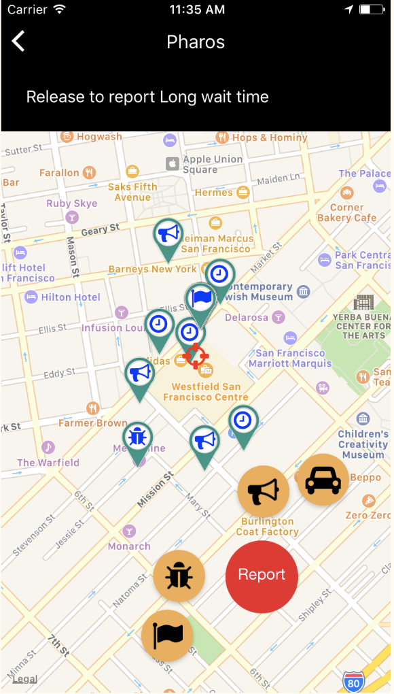

# Project Name




## Team

  - [Craig Dearden] - (https://github.com/cdearden)
  - [Efe Surekly] - (https://github.com/efesurekli)
  - [Michael Dai] - (https://github.com/michaelbdai)
  - [Sean O'Neal] - (https://github.com/sean-oneal)

## Table of Contents

1. [Usage](#Usage)
1. [Requirements](#requirements)
1. [Development](#development)
    1. [Installing Dependencies](#installing-dependencies)
    1. [Tasks](#tasks)
1. [Team](#team)
1. [Contributing](#contributing)

## Usage

> Some usage instructions

## Requirements

- Node 0.10.x
- Redis 2.6.x
- Postgresql 9.1.x
- etc
- etc

## Development

### Installing Dependencies

From within the root directory:

```sh
sudo npm install -g bower
npm install
bower install
```

### Roadmap

###

View the project roadmap [here](https://github.com/LuminousLeeks/Pharos/issues)


## Contributing

See [CONTRIBUTING.md](CONTRIBUTING.md) for contribution guidelines.
