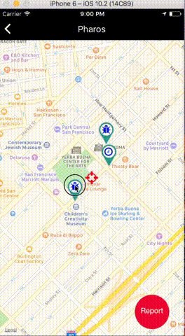

## Pharos by React-Native

A community driven, mobile awareness application
delivering real-time push notifications based on your interests and location


## Preview
A SnackBar component that can display inline: <br />


## Usage

> Some usage instructions

## Requirements

- Node 0.10.x
- Redis 2.6.x
- Postgresql 9.1.x
- etc
- etc

## Development

### Installing Dependencies

From within the root directory:

```sh
sudo npm install -g bower
npm install
bower install
```

### Roadmap

View the project roadmap [here](LINK_TO_PROJECT_ISSUES)


## Contributing

See [CONTRIBUTING.md](CONTRIBUTING.md) for contribution guidelines.
