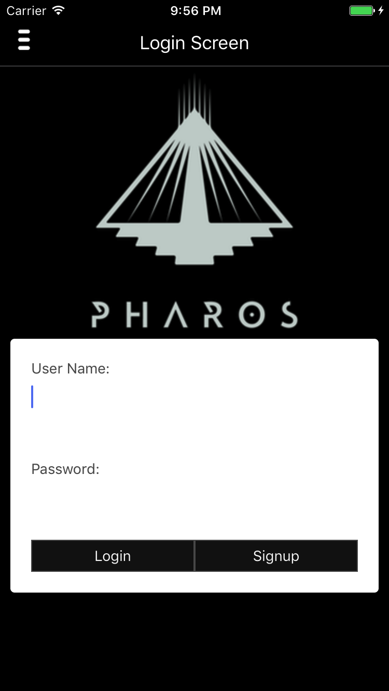

# Pharos
>A community driven, mobile awareness application
that delivers real-time event notifications based on your interests and location.

### Pharos Login


### Pharos Homepage


### Pharos Notification Menu


## Team

  - [Craig Dearden] - (https://github.com/cdearden)
  - [Efe Surekly]   - (https://github.com/efesurekli)
  - [Michael Dai]   - (https://github.com/michaelbdai)
  - [Sean O'Neal]   - (https://github.com/sean-oneal)

## Table of Contents

1. [Tech Stack](#techstack)
1. [Requirements](#requirements)
1. [Development](#development)
    1. [Installing Dependencies](#installing-dependencies)
    1. [Tasks](#tasks)
1. [Team](#team)
1. [Contributing](#contributing)

## Tech Stack
This application was built using the following technologies:
- React-Native
- Redux
- Redux Saga
- PostgreSQL
- PostGIS
- Express
- Socket.io

## Requirements

- Node 6.9.x
- Postgresql 9.1.x
- PostGIS 2.2.x
- Watchman

iOS Simulation:
- Xcode

## Development

### Installing Dependencies

From within the root directory:
```sh
npm install
```

If you do not have React-Native CLI installed:
```sh
npm install -g react-native-cli
```

Populate Data

### Launching App Simulator

From within the root directory:

Build the Database
```sh
npm run startdb
npm run buildb
npm run populatedb
```

Start the Server
```sh
npm run startServer
```

Launch the App
```sh
npm run startApp
```

Clearning the Database

```sh
npm run dropdb
npm run buildb
```

##Testing

Server Test
```sh
npm run testServer
```

Database Test
```sh
npm run testdb
```

## Roadmap

###

View the product roadmap [here](https://github.com/LuminousLeeks/Pharos/issues)


## Contributing

See [CONTRIBUTING.md](CONTRIBUTING.md) for contribution guidelines.
